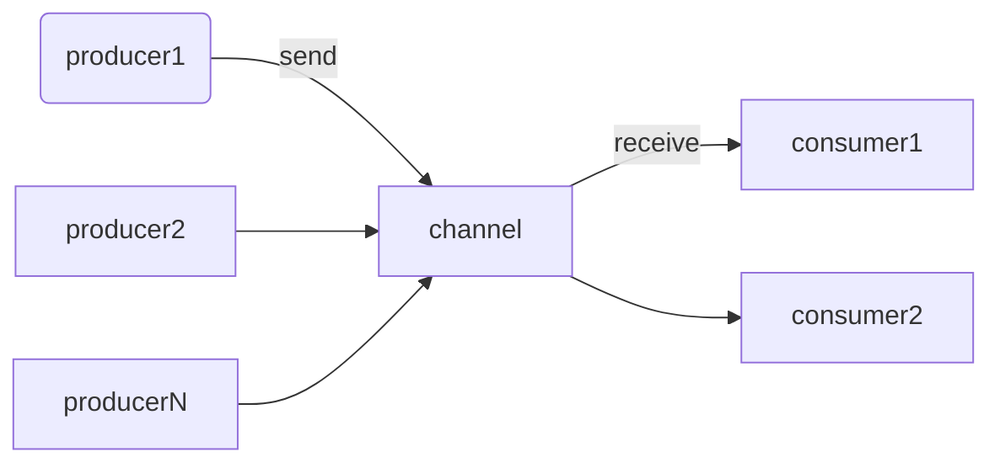

## Channel

Channel — это интерфейс, который реализует два других интерфейса:

• `SendChannel`, который используется для отправки элементов (добавления элементов).
и закрыть канал;
• `ReceiveChannel`, который получает (или принимает) элементы.

```kotlin
interface SendChannel<in E> {
	suspend fun send(element: E)
	fun close(): Boolean
	//...
}

interface ReceiveChannel<out E> {
	suspend fun receive(): E
	fun cancel(cause: CancellationException? = null)
	// ...
}

interface Channel<E> : SendChannel<E>, ReceiveChannel<E>
```

Благодаря этому различию мы можем предоставить доступ только к `ReceiveChannel` или
`SendChannel`, чтобы ограничить точки входа в канал.
Вы можете заметить, что функции отправки и получения приостанавливаются. Это важная особенность:

Когда мы пытаемся `receive`, а в канале нет элементов, сопрограмма приостанавливается до тех пор, пока элемент не станет доступен.

С другой стороны, `send` будет приостановлена, когда канал достигнет своей максимальной емкости. Скоро мы увидим, что у большинства каналов есть ограниченная емкость. Подобно метафорической книжной полке, когда кто-то пытается поставить книгу на полку, но она уже заполнена, этому человеку придется приостановиться до тех пор, пока кто-то не возьмет книгу и не освободит место.

Если вам необходимо отправить или получить данные из функции, которая не приостанавливается, вы можете использовать `trySend` и `tryReceive`. Обе операции выполняются немедленно и возвращают `ChannelResult`, который содержит информацию о успешном или неуспешном выполнении операции, а также ее результат. Используйте `trySend` и `tryReceive` только для каналов с ограниченной емкостью, потому что они не будут работать для канала свидания (rendezvous channel).

Канал может иметь любое количество отправителей и получателей. Однако наиболее распространённой ситуацией является наличие одной корутины на обоих концах канала.



```kotlin
suspend fun main(): Unit = coroutineScope {
	val channel = Channel<Int>()
	launch {
		repeat(5) { index ->
			delay(1000)
			println("Producing next one")
			channel.send(index * 2)
		}
	}

	launch {
		repeat(5) {
			val received = channel.receive()
			println(received)
		}
	}

}
// (1 sec)
// Producing next one
// 0
// (1 sec)
// Producing next one
// 2
// (1 sec)
// Producing next one
// 4
// (1 sec)
// Producing next one
// 6
// (1 sec)
// Producing next one
// 8
```

Предпочтительнее прослушивать данные на канале до тех пор, пока отправитель готов отправлять, вместо ожидания, что получатель знает количество элементов заранее. Это позволяет непрерывно принимать данные до закрытия канала. Для приема элементов из канала до его закрытия мы могли бы использовать цикл `for` или функцию `consumeEach`.

```kotlin
suspend fun main(): Unit = coroutineScope {
	val channel = Channel<Int>()
	launch {
		repeat(5) { index ->
			println("Producing next one")
			delay(1000)
			channel.send(index * 2)
		}
	channel.close()
	}

	launch {
		for (element in channel) {
			println(element)
		}
		// or
		// channel.consumeEach { element ->
		// println(element)
		// }
	}

}
```

Проблема этого способа отправки элементов заключается в том, что легко забыть закрыть канал, особенно в случае исключений. Если одна корутина прекращает производство из-за исключения, другая будет бесконечно ждать элементов. Гораздо удобнее использовать функцию `produce`, которая является конструктором корутины и возвращает `ReceiveChannel`.

Функция `ConsumerEach` использует внутри себя цикл `for`, но он также отменяет канал после того, как он израсходовал все его элементы (т. е. как только он будет закрыт).

```kotlin
// This function produces a channel with
// next positive integers from 0 to `max`
fun CoroutineScope.produceNumbers(
	max: Int
): ReceiveChannel<Int> = produce {
		var x = 0
		while (x < 5) send(x++)
	}
```

  
Функция `produce` закрывает канал всякий раз, когда корутина, созданная с ее помощью, завершается любым способом (finished, stopped, cancelled). Благодаря этому мы никогда не забудем вызвать `close`. Билдер `produce` - очень популярный способ создания канала, и это неслучайно: он предлагает много удобства и безопасности.

```kotlin
suspend fun main(): Unit = coroutineScope {
	val channel = produce {
	repeat(5) { index ->
			println("Producing next one")
			delay(1000)
			send(index * 2)
		}
	}

	for (element in channel) {
		println(element)
	}

}
```

## Channel types

В зависимости от установленного размера емкости можно выделить четыре типа каналов:
* `Unlimited` - канал с емкостью `Channel.UNLIMITED`, у которого буфер имеет неограниченную емкость, и операции `send` никогда не приостанавливаются.
* `Buffered` - канал с конкретным размером емкости или `Channel.BUFFERED` (по умолчанию 64 и может быть изменен через установку системного свойства kotlinx.coroutines.channels.defaultBuffer в JVM).
* `Rendezvous` (default) - канал с емкостью 0 или `Channel.RENDEZVOUS` (равным 0), что означает, что обмен может произойти только если отправитель и получатель встречаются (это похоже на точку обмена книгами, а не на книжную полку).
* `Conflated` - канал с емкостью `Channel.CONFLATED`, у которого буфер размером 1, и каждый новый элемент заменяет предыдущий.

Давайте посмотрим, как эти емкости работают на практике. Мы можем задать их непосредственно для `Channel` или указать при вызове функции `produce`. Мы сделаем нашего производителя быстрым, а получателя медленным. При неограниченной емкости канал должен принять все элементы и затем передать их для поочередного приема.

```kotlin
suspend fun main(): Unit = coroutineScope {
	val channel = produce(capacity = Channel.UNLIMITED) {
		repeat(5) { index ->
			send(index * 2)
			delay(100)
			println("Sent")
		}
	}

	delay(1000)
	for (element in channel) {
		println(element)
		delay(1000)
	}

}

// Sent
// (0.1 sec)
// Sent
// (0.1 sec)
// Sent
// (0.1 sec)
// Sent
// (0.1 sec)
// Sent
// (1 - 4 * 0.1 = 0.6 sec)
// 0
// (1 sec)
// 2
// (1 sec)
// 4
// (1 sec)
// 6
// (1 sec)
// 8
// (1 sec)
```

При конкретной емкости сначала будет происходить производство до заполнения буфера, после чего производителю придется начать ожидание получателя.

```kotlin
suspend fun main(): Unit = coroutineScope {
	val channel = produce(capacity = 3) {
	repeat(5) { index ->
			send(index * 2)
			delay(100)
			println("Sent")
		}
	}

	delay(1000)
	for (element in channel) {
		println(element)
		delay(1000)
	}

}

// Sent
// (0.1 sec)
// Sent
// (0.1 sec)
// Sent
// (1 - 2 * 0.1 = 0.8 sec)
// 0
// Sent
// (1 sec)
// 2
// Sent
// (1 sec)
// 4
// (1 sec)
// 6
// (1 sec)
// 8
// (1 sec)
```

При использовании канала с емкостью по умолчанию (или `Channel.RENDEZVOUS`) производитель всегда будет ожидать получателя.

```kotlin
suspend fun main(): Unit = coroutineScope {
	val channel = produce {
		// or produce(capacity = Channel.RENDEZVOUS) {
		repeat(5) { index ->
			send(index * 2)
			delay(100)
			println("Sent")
		}
	}

	delay(1000)
	for (element in channel) {
		println(element)
		delay(1000)
	}

}

// 0
// Sent
// (1 sec)
// 2
// Sent
// (1 sec)
// 4
// Sent
// (1 sec)
// 6
// Sent
// (1 sec)
// 8
// Sent
// (1 sec)
```

Наконец, при использовании емкости` Channel.CONFLATED` мы не будем хранить предыдущие элементы. Новые элементы заменят предыдущие, поэтому мы сможем получить только последний элемент, теряя при этом элементы, отправленные ранее.

```kotlin
suspend fun main(): Unit = coroutineScope {
	val channel = produce(capacity = Channel.CONFLATED) {
		repeat(5) { index ->
			send(index * 2)
			delay(100)
			println("Sent")
		}
	}

	delay(1000)
	for (element in channel) {
		println(element)
		delay(1000)
	}

}

// Sent
// (0.1 sec)
// Sent
// (0.1 sec)
// Sent
// (0.1 sec)
// Sent
// (0.1 sec)
// Sent
// (1 - 4 * 0.1 = 0.6 sec)
// 8
```

## On buffer overflow

Для дополнительной настройки каналов мы можем контролировать, что происходит, когда буфер заполнен (параметр `onBufferOverflow`). Вот доступные варианты:

- `SUSPEND` (по умолчанию) - когда буфер заполнен, приостанавливать метод `send`.
- `DROP_OLDEST` - когда буфер заполнен, удалять самый старый элемент.
- `DROP_LATEST` - когда буфер заполнен, удалять последний элемент.

Да, вы правильно догадались. Емкость канала `Channel.CONFLATED` эквивалентна установке емкости на 1 и параметра `onBufferOverflow` на `DROP_OLDEST`. В настоящее время функция `produce` не позволяет устанавливать настраиваемое `onBufferOverflow`, поэтому для его установки нам нужно определить канал, используя функцию `Channel`.

```kotlin
suspend fun main(): Unit = coroutineScope {  
    val channel = Channel<Int>(  
        capacity = 2,  
        onBufferOverflow = BufferOverflow.DROP_OLDEST  
    )  
  
    launch {  
        repeat(5) { index ->  
            channel.send(index * 2)  
            delay(100)  
            println("Sent")  
        }  
        channel.close()  
    }  
  
    delay(1000)  
    for (element in channel) {  
        println(element)  
        delay(1000)  
    }  
}
// Sent
// (0.1 sec)
// Sent
// (0.1 sec)
// Sent
// (0.1 sec)
// Sent
// (0.1 sec)
// Sent
// (1 - 4 * 0.1 = 0.6 sec)
// 6
// (1 sec)
// 8
```