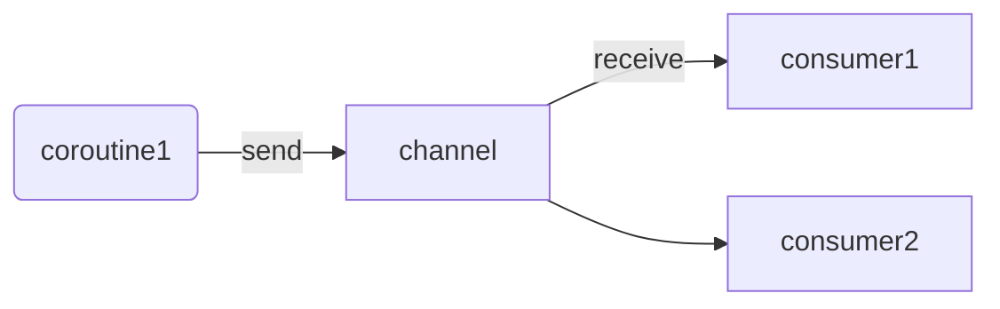
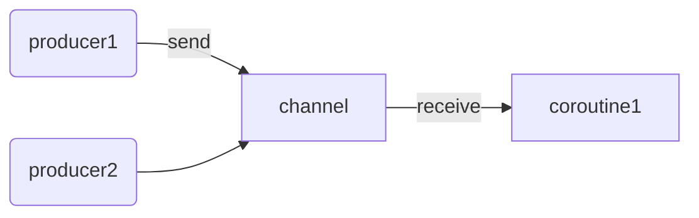

## Об обработчике недоставленного элемента 

Еще один параметр функции канала, о котором нам следует знать, это `onUndeliveredElement`. Он вызывается, когда элемент не может быть обработан по какой-то причине. Чаще всего это означает, что канал был закрыт или отменен, но это также может произойти, когда `send`, `receive`, `receiveOrNull` или `hasNext` вызывают ошибку. Обычно мы используем его для закрытия ресурсов, которые были отправлены через этот канал.

```kotlin
val channel = Channel<Resource>(capacity) { resource ->
	resource.close()
}
// or
// val channel = Channel<Resource>(
// capacity,
// onUndeliveredElement = { resource ->
// resource.close()
// }
// )

// Producer code
val resourceToSend = openResource()
channel.send(resourceToSend)

// Consumer code
val resourceReceived = channel.receive()
try {
	// work with received resource
} finally {
	resourceReceived.close()
}
```

## Разветвление 
Несколько корутин могут получать данные из одного канала; однако для их правильного получения мы должны использовать цикл `for` (`consumeEach` не безопасен для использования из нескольких корутин).



```kotlin
fun CoroutineScope.produceNumbers() = produce {
	repeat(10) {
		delay(100)
		send(it)
	}
}

fun CoroutineScope.launchProcessor(
	id: Int,
	channel: ReceiveChannel<Int>
) = launch {
	for (msg in channel) {
		println("#$id received $msg")
	}
}

suspend fun main(): Unit = coroutineScope {
	val channel = produceNumbers()
	repeat(3) { id ->
		delay(10)
		launchProcessor(id, channel)
	}
}

// #0 received 0
// #1 received 1
// #2 received 2
// #0 received 3
// #1 received 4
// #2 received 5
// #0 received 6
// ...
```

Элементы распределяются равномерно. В канале есть очередь FIFO (первым пришел — первым ушел) из корутин, ожидающих элемент. Поэтому в приведенном выше примере видно, что элементы получают следующие корутины (0, 1, 2, 0, 1, 2 и так далее).

Чтобы лучше понять это, представьте детей в детском саду, стоящих в очереди за конфетами. Как только они получают конфеты, они сразу их съедают и встают в конец очереди. Такое распределение справедливо (при условии, что количество конфет кратно количеству детей и родители не против, чтобы их дети ели конфеты).

## Слияние 

Несколько корутин могут отправлять данные в один канал. В приведенном ниже примере вы можете увидеть две корутины, отправляющие элементы в один и тот же канал.



```kotlin
suspend fun sendString(
	channel: SendChannel<String>,
	text: String,
	time: Long
) {
	while (true) {
		delay(time)
		channel.send(text)
	}
}

fun main() = runBlocking {
	val channel = Channel<String>()
	launch { sendString(channel, "foo", 200L) }
	launch { sendString(channel, "BAR!", 500L) }
	repeat(50) {
		println(channel.receive())
	}
	coroutineContext.cancelChildren()
}
// (200 ms)
// foo
// (200 ms)
// foo
// (100 ms)
// BAR!
// (100 ms)
// foo
// (200 ms)
// ...
```

Иногда нам нужно объединить несколько каналов в один. Для этого вы можете найти полезной следующую функцию, которая объединяет несколько каналов с помощью функции `produce`:

```kotlin
fun <T> CoroutineScope.fanIn(
	channels: List<ReceiveChannel<T>>
): ReceiveChannel<T> = produce {
	for (channel in channels) {
		launch {
			for (elem in channel) {
				send(elem)
			}
		}
	}
}
```

## Потоки данных

Иногда мы настраиваем два канала таким образом, что один создает элементы на основе тех, что получает от другого. В таких случаях мы называем это потоком данных или пайплайном.

```kotlin
// A channel of number from 1 to 3
fun CoroutineScope.numbers(): ReceiveChannel<Int> =
	produce {
		repeat(3) { num ->
			send(num + 1)
		}
	}

fun CoroutineScope.square(numbers: ReceiveChannel<Int>) =
	produce {
		for (num in numbers) {
			send(num * num)
		}
	}

suspend fun main() = coroutineScope {
	val numbers = numbers()
	val squared = square(numbers)
	for (num in squared) {
		println(num)
	}
}
// 1
// 4
// 9
```

## Каналы как примитив коммуникации

Каналы полезны, когда разные корутины должны общаться друг с другом. Они гарантируют отсутствие конфликтов (то есть проблем с общим состоянием) и справедливость. Чтобы увидеть их в действии, представьте, что разные бариста готовят кофе. Каждый бариста должен быть отдельной корутиной, работающей независимо. Разные виды кофе готовятся за разное время, но мы хотим обрабатывать заказы в порядке их поступления. Самый простой способ решить эту проблему - отправлять как заказы, так и готовый кофе в каналы. Баристу можно определить, используя конструктор produce:

```kotlin
suspend fun CoroutineScope.serveOrders(
	orders: ReceiveChannel<Order>,
	baristaName: String
): ReceiveChannel<CoffeeResult> = produce {
	for (order in orders) {
		val coffee = prepareCoffee(order.type)
		send(
			CoffeeResult(
					coffee = coffee,
					customer = order.customer,
					baristaName = baristaName
			)
		)
	}
}
```

Когда мы настраиваем поток данных, мы можем использовать ранее определенную функцию `fanIn` для объединения результатов, полученных разными бариста, в один:

```kotlin
val coffeeResults = fanIn(
	serveOrders(ordersChannel, "Alex"),
	serveOrders(ordersChannel, "Bob"),
	serveOrders(ordersChannel, "Celine"),
)
```

Вы найдете больше практических примеров в следующей главе.

## Практическое применение

Одна из типичных ситуаций, когда мы используем каналы, - это когда значения производятся с одной стороны, а мы хотим их обработать с другой стороны. Примеры включают реакцию на клики пользователя, новые уведомления от сервера или обновление результатов поиска с течением времени (хорошим примером является SkyScanner, который ищет самые дешевые авиабилеты, опрашивая несколько авиакомпаний). Однако в большинстве случаев лучше использовать `channelFlow` или `callbackFlow`, оба из которых являются гибридом `Channel` и `Flow` (мы `объясним` их в главе о создании потока данных).

```kotlin
// A simplified implementation
suspend fun handleOfferUpdates() = coroutineScope {
	val sellerChannel = listenOnSellerChanges()

	val offerToUpdateChannel = produce(capacity = UNLIMITED) {
		repeat(NUMBER_OF_CONCURRENT_OFFER_SERVICE_REQUESTS) {
			launch {
				for (seller in sellerChannel) {
					val offers = offerService
						.requestOffers(seller.id)
					offers.forEach { send(it) }
				}
			}
		}
	}

	repeat(NUMBER_OF_CONCURRENT_UPDATE_SENDERS) {
		launch {
			for (offer in offerToUpdateChannel) {
				sendOfferUpdate(offer)
			}
		}
	}
	
}
```

## Резюме

Канал - это мощный примитив межкорутинного взаимодействия. Он поддерживает любое количество отправителей и получателей, и каждое значение, отправленное в канал, принимается один раз. Мы часто создаем канал с помощью конструктора `produce`. Каналы также могут быть использованы для настройки потока данных, где мы контролируем количество корутин, работающих над определенными задачами. В настоящее время мы чаще всего используем каналы в связке с `Flow`, о котором будет рассказано позже в книге.